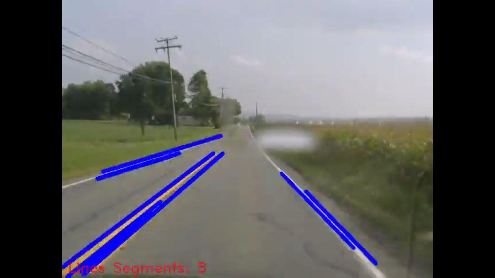
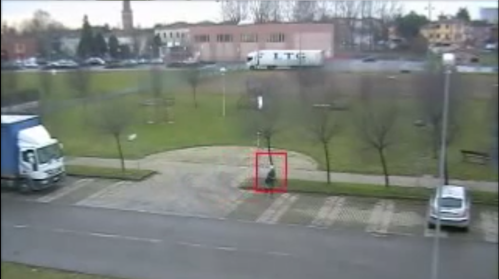
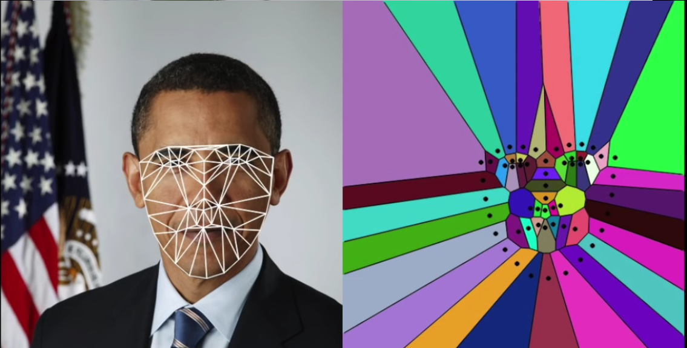
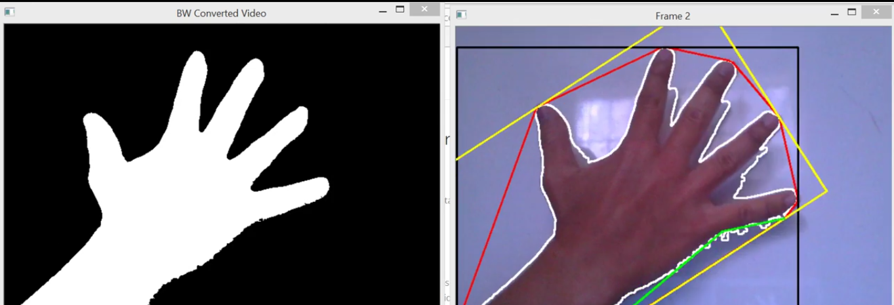
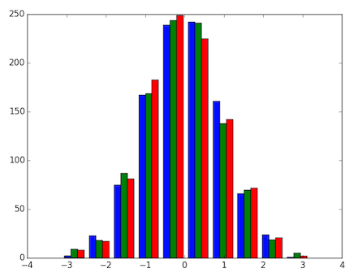
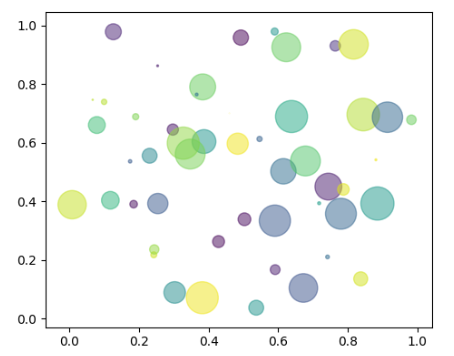
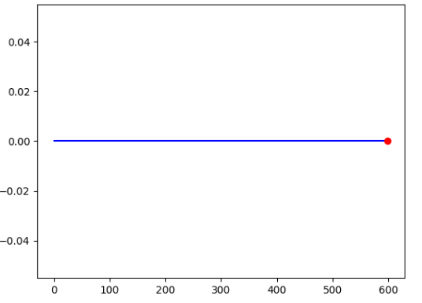
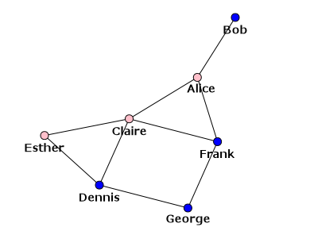
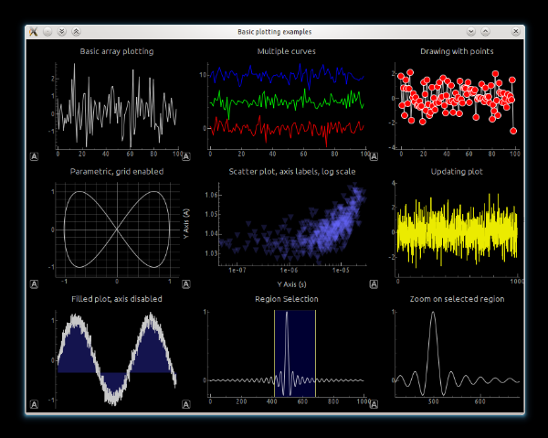

# Etat de l’art des différentes visualisations que l’on peut inclure dans une vidéo.

Ce document a pour but de présenter les différents visuels, graphiques et charts qu’on peut ajouter dans une vidéo pour pouvoir améliorer l’affichage et la perception de l’information visuelle

## Visualisation avec OpenCV
* Détection de ligne

<a href="https://www.youtube.com/watch?v=vaj7P-6MByo">source</a>
* Détection de mouvement

<a href="https://www.youtube.com/watch?v=lzRGp3nc8Tw">source</a>
* Triangulation & diagramme de Voronoi

<a href="https://www.youtube.com/watch?v=GGx8gxp9LyY">source</a>
* Enveloppe convexe d'objet

<a href="https://www.youtube.com/watch?v=W7YKrMynXpE">source</a>

## Visualisation avec Python
* Matplotlib
  * Graphiques classiques tels que l'histogramme  
  
  * Scatter plot  
  
  * Une timeline  
  
  * ...
liste exhaustive de toutes les visualisations réalisables avec <a href="https://matplotlib.org/gallery.html#">Matplotlib</a>
* Igraph  
  
<a href="http://igraph.org/python/">source</a>
* PyQtGraph  
  
<a href="http://www.pyqtgraph.org/">source</a>
