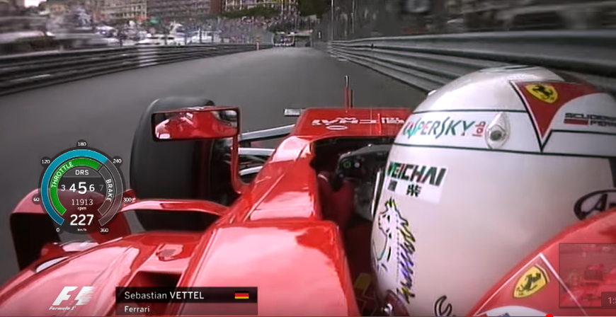
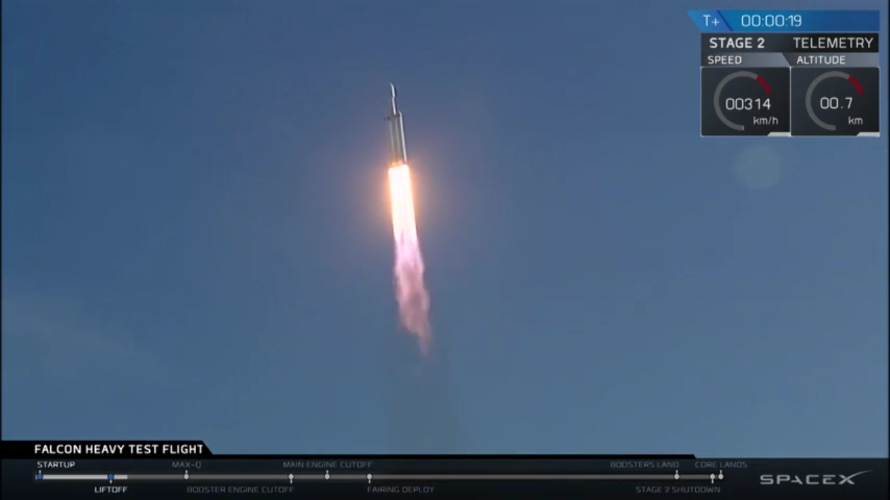
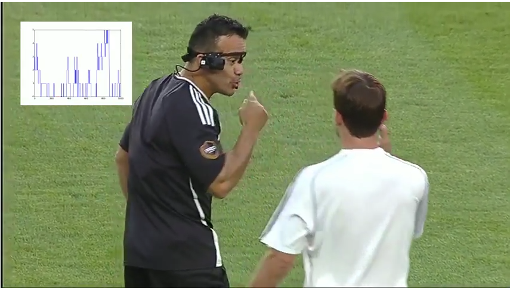
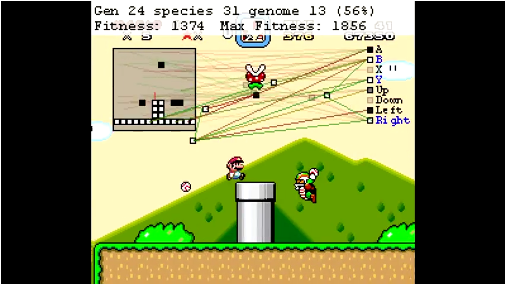

# Etat de l’art des différentes visualisations que l’on peut inclure dans une vidéo.

## Introduction
Le but de ce document est de présenter les différentes visualisations utilisées pour représenter un graphique dans une vidéo quel qu’en soit le domaine d’application. L’objectif est de montrer la diversité des tracés et la façon que chacun a de les mettre en forme, de les utiliser dans une vidéo afin de véhiculer de l'information supplémentaire de manière compréhensible.

## Voitures
Les vidéos de voitures (dashcam, mais aussi télévision pour les grandprix, etc) possèdent en général des graphiques qui sont placés en périphérie de l'image. Par exemple une carte du circuit en haut à gauche de l'image, un compte tour en bas à droite, etc. Cela se justifie par le fait que l'information réellement importante est ce qui se passe à l'écran, le mouvement de la voiture. Les indicateurs ajoutés sont là pour permettre au spectateur de mieux comprendre ce qu'il voit, mais ne constituent pas l'information principale.

* Dashcam de Rally  
Dans cette vidéo de rally, on voit par exemple des graphiques renseignant sur le nombre de tours par minute effectués par le moteur ou encore un compteur de vitesse. Ces graphiques ont la forme de compteurs que l'on peut trouver dans une voiture afin de paraître familier à l'utilisateur et donc faciliter sa lecture.

<a href="https://www.youtube.com/watch?v=CnXahzECtUo">source</a> 

Dans cette vidéo on a 4 types de visualisations : Des cadrans ressemblant à des compteurs de voiture, des jauges se remplissant, des emplacements de texte et un graphique du type linechart.
Les données présentes sont des données physiques sur l'état du véhicule (accélération, freinage, rotations par minutes du moteur, vitesse linéaire instantanée, rapport enclenché, un baromètre de pression) ou de l'environnement (température de l'air en entrée de l'aération) et une donnée de temps (depuis le départ). Ces données sont rafraîchies en temps réel au fur et à mesure de la vidéo.

Les graphiques sous forme de compteur de voiture possèdent des curseurs qui pointent sur une échelle pour indiquer une valeur, tant dis que les jauges n'ont pas de données numériques mais indiquent plutôt une proportion. Le graphique temporel montrant la température de l'air entrant n'a pas besoin de curseur non plus car l'instant présent est représenté à l'extrémité droite du graphique.

Tout ces indicateurs sont là pour aider le spectateurs à comprendre le comportement de la voiture ainsi que le pilotage du conducteur.

* Formule 1  
On peut voir dans cette vidéo un compteur en semi transparence qui permet d’avoir énormément d’informations sur l’état de la conduite sans empêcher la vue sur l’ensemble de la course. Bien sûr ici le but est d’ajouter au spectacle, des informations supplémentaires.
On peut voir que ce type de diagramme mixte permet de d’inclure énormément d’informations: on a par exemple de l’information sur les tours par minute du moteur, un information sur la position du levier de vitesse, la vélocité du véhicule et l’utilisation des pédales

<a href="https://www.youtube.com/watch?v=6yXv9SeahV8">source</a> 

Il y 2 types de visualisation dans cette image : des données textuelles ainsi que des jauges.
Les jauges renseignent sur la conduite du pilote (accélération ou freinage) ainsi que sur la vitesse du véhicule. Cependant, seule la jauge de vitesse possède une graduation de la même manière que précédemment. Des indications supplémentaires sur le pilotage sont disponibles sous forme de texte avec par exemple le rapport enclenché  actuellement ainsi que le nombre de rotation par minute effectué par l'arbre moteur. Enfin, la vitesse est rappelée sous forme textuelle pour connaître la valeur exacte et des labels sont annotés sur les jauges pour pouvoir les distinguer.
Le spectateur dispose également du nom ainsi que de la  nationalité et l'écurie pour laquelle le pilote court.

Ces données sont mises à jour instantanément afin de pouvoir aider le spectateur à comprendre la conduite du pilote, mettre un nom sur la personne actuellepment suivie et donc également faciliter la compréhension globale de la course.

## Aérospatial 

<a href="https://www.youtube.com/watch?v=-B_tWbjFIGI">source</a> 

Cet image est extraite du lancement de Falcon Heavy, le lanceur réutilisable de la société SpaceX. Le phénomène observé est donc assez complexe et d'ordinaire plus artistique que scientifiquement attrayant pour un spectateur lambda. C'est pourquoi SpaceX y a ajouté des graphiques pour rendre le contenu plus facilement compréhensible. 
On compte 3 visualisations différentes : Une timeline au bas de l'image, deux graphiques sous forme de jauges circulaires accompagnées de texte ainsi qu'un timer. 
Les jauges circulaires renseignent respectivement sur la vitesse et l'altitude du lanceur alors que le timer nous donne le temps jusqu'au (et ensuite depuis) le lancement. Quandt à elle, la timeline nous indique où l'événement en est ainsi que le prochain événement à venir. Ainsi on peut également avoir accès à la liste des événements en la regardant et l'ordre dans lequel ils s'enchaîneront. Enfin, en estimant la distance les séparant on peut en déduire le temps que chaque événement prend. La timeline est placée au bas de l'image pour rappeler un slider d'une vidéo lambda ou d'un quelconque lecteur de vidéo qui possède classiquement ce slider en bas de son interface.

Toutes ces données sont mises à jour instantanément et offre au spectateur un navigation facilitée dans la vidéo et une capacité de compréhension accrue.

## Sports
* Tennis 
De la même manière que pour des vidéos de voiture, les vidéos a contenu sportif sont souvent accompagnées soit de graphiques en périphérie de l'image, soit de graphiques en plein écran utilisés lors de séquence où l'action est 'en pose'.
Il faut pouvoir montrer au spectateur l'action sans que les informations annexes ne gâche son expérience.

<a href="https://www.youtube.com/watch?v=9Rt5v_SPk6Y">source</a> 

La vidéo ci-dessus comporte 3 types de visualisations : une timeline, des indicateurs chiffrés et un indicateur de frappe de la balle.
La timeline est interactive, elle offre la possibilité à l'utilisateur du logiciel (pas au spectateur directement) de pouvoir naviguer dans la vidéo plus facilement et d'avant en arrière. De plus, elle est formée de balles de tennis de couleurs différentes pour indiquer les moments où un balle est frappée et si le coup est droit ou est un revert.
Les indicateurs textuels, situés sur la droite de la vidéo, renseigne sur la vitesse de la balle ansi que la vitesse du frappeur au moment de l'impact. Enfin on trouve au même emplacement le spin de la balle. 
Sous cette zone de texte se situe un emplacement où se dessine une raquette à chaque coup donné par le tennisman. Soit orientée vers la gauche pour un coup droit, soit vers la droite pour un revers. De plus, l'endroit de l'impact peut être connu grâce au dessin de la balle au moment de la frappe.

Grâce à ces graphiques on peut mieux comprendre où frappe la balle lors des swings et se déplacer plus facilement en se repérant grâce à la timeline.

* Football 

<a href="https://www.youtube.com/watch?v=s4PpmGWf9Gc">source</a> 

Cette vidéo est issue de nos résultats obtenus lors de ce projet. Elle possède une timeline indiquant à chaque frame de la vidéo combien de visage notre algorithme a detecté. Elle permet ainsi à un internaute d'anticiper ce qu'il y aura à l'écran.
Les données indiquées dessus ne sont pas rafraîchies en temps réelle mais calculées au préalable et un curseur indique la progression de la vidéo.

## Jeux vidéos
* Mario et le machine learning 
Ici on a deux captures d'écran de vidéos qui tentent d'expliquer comment une personne a réussi a apprendre à une machin à jouer à Mario et MarioKart. 
Dans la première image, le graphique correspond en des connexions neuronales qui s'effectuent au long de la vidéo pour visualier quel synapse s'active à quel moment. 

<a href="https://www.youtube.com/watch?v=qv6UVOQ0F44">source</a> 
Tant dis que sur la seconde image on a deux graphiques : Une carte avec les positions des joueurs dessus, et une carte d'activation des neurones du réseau de neurone utilisé pour entraîner la machine.

<a href="https://www.youtube.com/watch?v=Ipi40cb_RsI">source</a>
