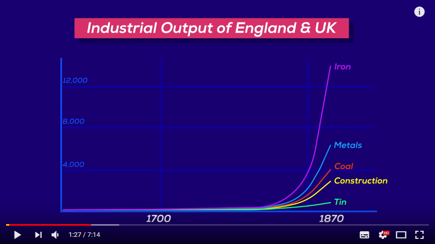
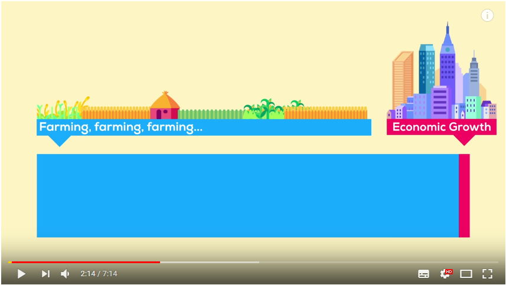
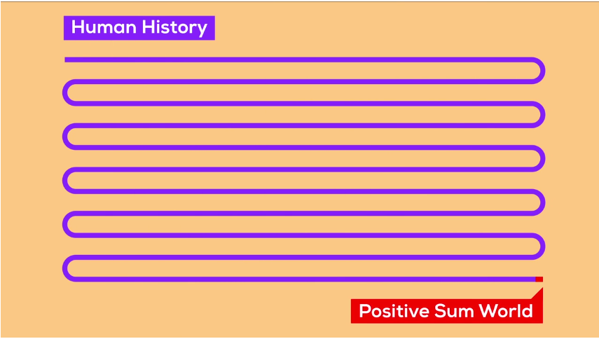
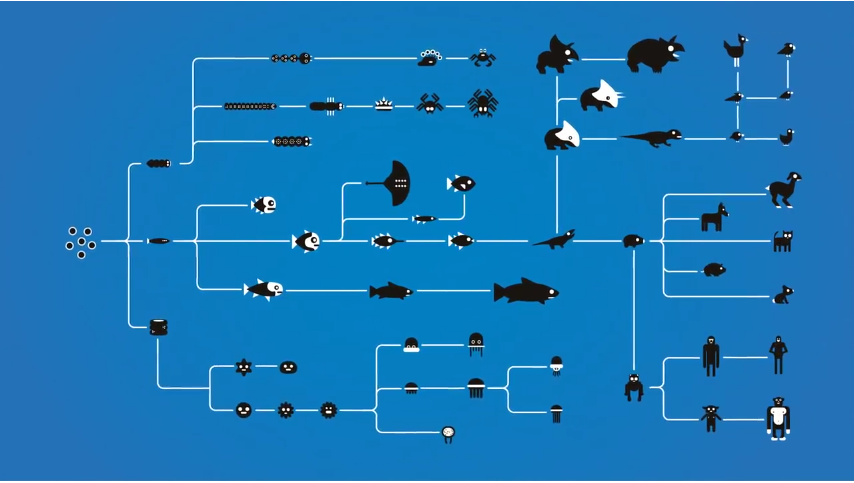
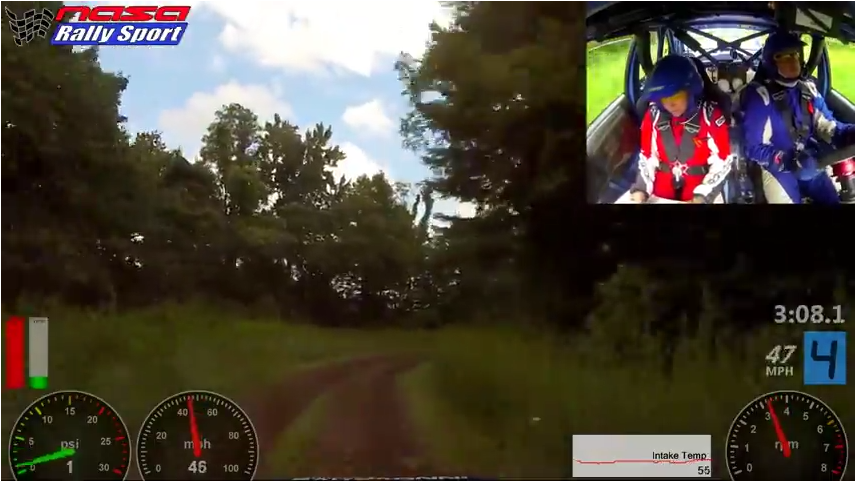
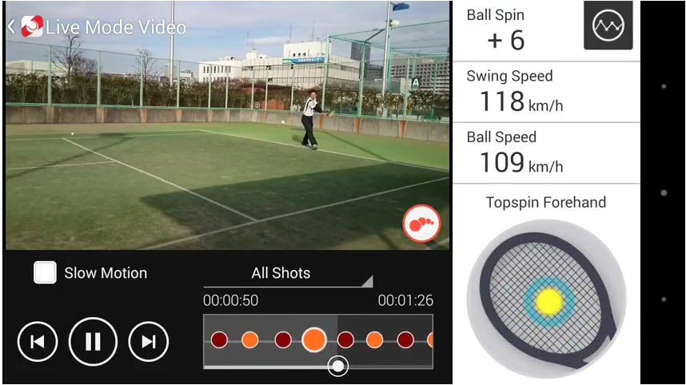

# Etat de l’art des différentes visualisations que l’on peut inclure dans une vidéo.

## Introduction
Le but de ce document est de présenter les différentes visualisations actuelles dans les domaines que nous avons étudié au cours du projet informatique numéro 8 sur les insertions de visualisations dans des vidéos de drone et de dashcam. On cherche à présenter les différents domaines d’utilisation avec les graphiques associés les plus adaptés à ces différents scénarios

## Vulgarisation 
Ce type de vidéos s'adresse à un public pas forcément toujours éduqué sur le sujet, c'est pourquoi il faut que l'auteur fasse des choses simples, visuelles et qui ne demandent pas une forte capacité d'analyse.
La plupart du temps, il est important que l'attention du spectateur se concentre sur le graphique lui-même c'est pourquoi l'auteur le place en plein écran.
* Line chart  
Ce graphique nous donne une indication de proportion et est simple de compréhension.

<a href="https://www.youtube.com/watch?v=rvskMHn0sqQ">source</a>

* Timeline  
De la même manière, ces timelines renseignent sur une information relative, des tailles relatives, et non pas sur des nombres crus ; car ici c'est tout d'abord les proportions qui sont importantes à faire comprendre au spectateur.

<a href="https://www.youtube.com/watch?v=rvskMHn0sqQ">source</a>

<a href="https://www.youtube.com/watch?v=rvskMHn0sqQ">source</a>

<a href="https://www.youtube.com/watch?v=UjtOGPJ0URM">source</a>
* Evolution chart  

<a href="https://www.youtube.com/watch?v=hOfRN0KihOU">source</a>

## Voitures
Les vidéos de voitures (dashcam, mais aussi télévision pour les grandprix, etc) possèdent en général des graphiques qui sont placés en périphérie de l'image. Par exemple une carte du circuit en haut à gauche de l'image, un compte tour en bas à droite, etc. Cela se justifie par le fait que l'information réellement importante est ce qui se passe à l'écran, le mouvement de la voiture. Les indicateurs ajoutés sont là pour permettre au spectateur de mieux comprendre ce qu'il voit, mais ne constituent pas l'information principale.

* Dashcam de Rally  
Dans cette vidéo de rally, on voit par exemple des graphiques renseignant sur le nombre de tours par minute effectués par le moteur ou encore un compteur de vitesse. Ces graphiques ont la forme de compteurs que l'on peut trouver dans une voiture afin de paraître familier à l'utilisateur et donc faciliter sa lecture.

<a href="https://www.youtube.com/watch?v=CnXahzECtUo">source</a>

* Formule 1  
On peut voir dans cette vidéo un compteur en semi transparence qui permet d’avoir énormément d’informations sur l’état de la conduite sans empêcher la vue sur l’ensemble de la course. Bien sûr ici le but est d’ajouter au spectacle, des informations supplémentaires.
On peut voir que ce type de diagramme mixte permet de d’inclure énormément d’informations: on a par exemple de l’information sur les tours par minute du moteur, un information sur la position du levier de vitesse, la vélocité du véhicule et l’utilisation des pédales

<a href="https://www.youtube.com/watch?v=6yXv9SeahV8">source</a>

## Sports
De la même manière que pour des vidéos de voiture, les vidéos a contenu sportif sont souvent accompagnées soit de graphiques en périphérie de l'image, soit de graphiques en plein écran utilisés lors de séquence où l'action est 'en pose'.
Il faut pouvoir montrer au spectateur l'action sans que les informations annexes ne gâche son expérience.

<a href="https://www.youtube.com/watch?v=9Rt5v_SPk6Y">source</a>
