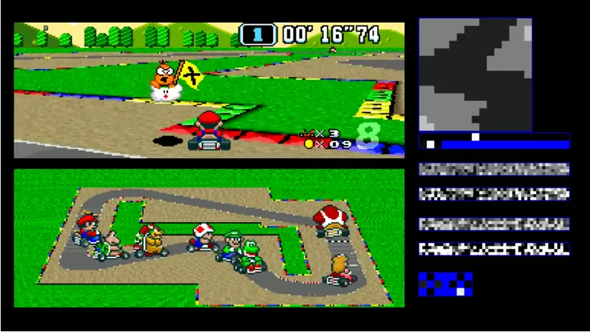

# Etat de l’art des différentes visualisations que l’on peut inclure dans une vidéo.

## Introduction
Le but de ce document est de présenter les différentes visualisations utilisées pour représenter un graphique dans une vidéo quel qu’en soit le domaine d’application. L’objectif est de montrer la diversité des tracés et la façon que chacun a de les mettre en forme, de les utiliser dans une vidéo afin de véhiculer de l'information supplémentaire de manière compréhensible.

## Voitures
Les vidéos de voitures (dashcam, mais aussi télévision pour les grandprix, etc) possèdent en général des graphiques qui sont placés en périphérie de l'image. Par exemple une carte du circuit en haut à gauche de l'image, un compte tour en bas à droite, etc. Cela se justifie par le fait que l'information réellement importante est ce qui se passe à l'écran, le mouvement de la voiture. Les indicateurs ajoutés sont là pour permettre au spectateur de mieux comprendre ce qu'il voit, mais ne constituent pas l'information principale.

* Dashcam de Rally  
Dans cette vidéo de rally, on voit par exemple des graphiques renseignant sur le nombre de tours par minute effectués par le moteur ou encore un compteur de vitesse. Ces graphiques ont la forme de compteurs que l'on peut trouver dans une voiture afin de paraître familier à l'utilisateur et donc faciliter sa lecture.

<a href="https://www.youtube.com/watch?v=CnXahzECtUo">source</a>

* Formule 1  
On peut voir dans cette vidéo un compteur en semi transparence qui permet d’avoir énormément d’informations sur l’état de la conduite sans empêcher la vue sur l’ensemble de la course. Bien sûr ici le but est d’ajouter au spectacle, des informations supplémentaires.
On peut voir que ce type de diagramme mixte permet de d’inclure énormément d’informations: on a par exemple de l’information sur les tours par minute du moteur, un information sur la position du levier de vitesse, la vélocité du véhicule et l’utilisation des pédales

<a href="https://www.youtube.com/watch?v=6yXv9SeahV8">source</a>

## Aérospatial 

<a href="https://www.youtube.com/watch?v=-B_tWbjFIGI">source</a>

## Sports
* Tennis 
De la même manière que pour des vidéos de voiture, les vidéos a contenu sportif sont souvent accompagnées soit de graphiques en périphérie de l'image, soit de graphiques en plein écran utilisés lors de séquence où l'action est 'en pose'.
Il faut pouvoir montrer au spectateur l'action sans que les informations annexes ne gâche son expérience.

<a href="https://www.youtube.com/watch?v=9Rt5v_SPk6Y">source</a>

* Football 

<a href="https://www.youtube.com/watch?v=s4PpmGWf9Gc">source</a>

## Jeux vidéos
* Mario et le machine learning 
Ici on a deux captures d'écran de vidéos qui tentent d'expliquer comment une personne a réussi a apprendre à une machin à jouer à Mario et MarioKart. 
Dans la première image, le graphique correspond en des connexions neuronales qui s'effectuent au long de la vidéo pour visualier quel synapse s'active à quel moment. 

<a href="https://www.youtube.com/watch?v=qv6UVOQ0F44">source</a> 
Tant dis que sur la seconde image on a deux graphiques : Une carte avec les positions des joueurs dessus, et une carte d'activation des neurones du réseau de neurone utilisé pour entraîner la machine.

<a href="https://www.youtube.com/watch?v=Ipi40cb_RsI">source</a>
